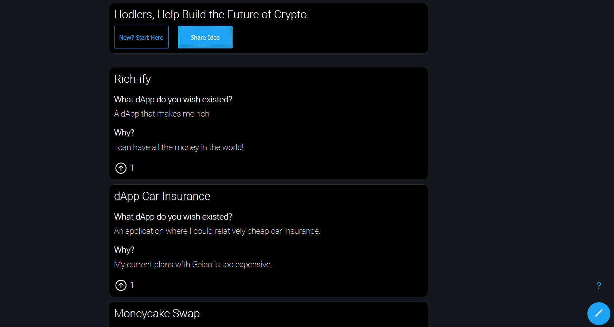
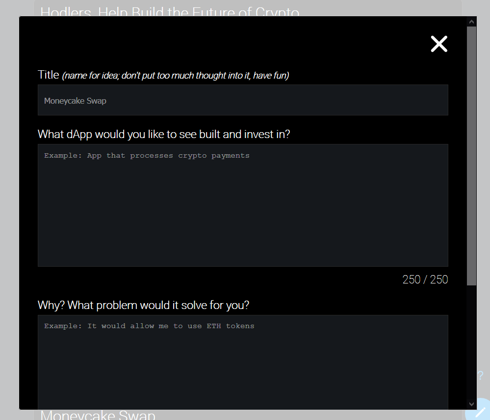
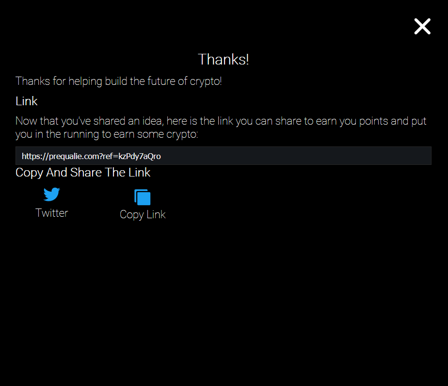

# Crypto Idea Repo

## Description

Simple website used to collect feedback from users in the crypto space; feedback on what types of dApps they'd like to see built.

To see the site, click [here](https://prequalie.com).

## Background

I recently fell in love with the crypto space, and I'd like to see it pushed forward.  Pushed forward in the sense of working on solving the problems that others would find valuable.

On top of that, I just felt like writing some code.

## Stack

* Front-End: React.js
* Back-End: Express, Postgres

## Additional Technical Information

* Please view `./docs/whitepaper.md`